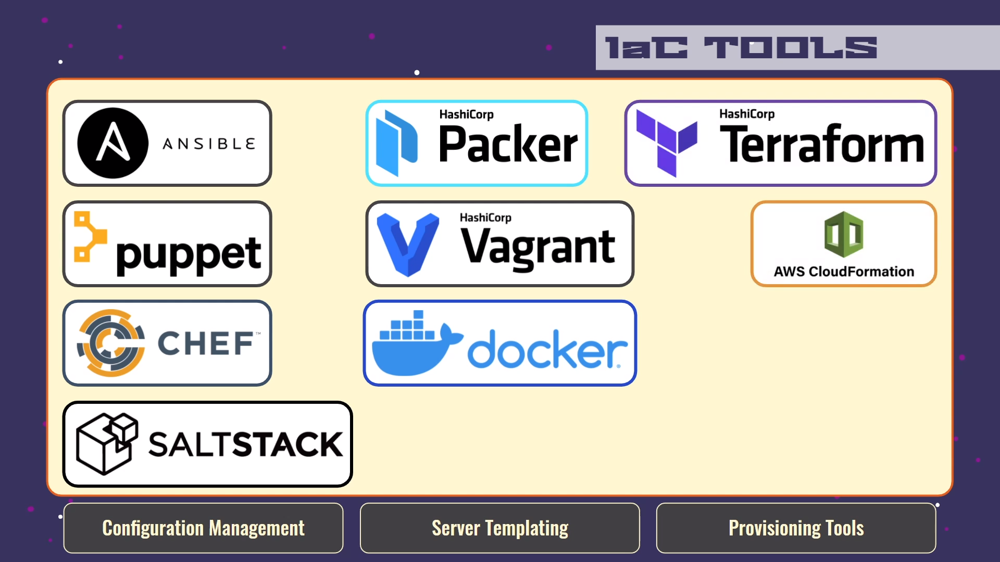

# Infrastructure-as-Code

Инфраструктура как код (Incfastructure as Code – IaC) – это описание всей имеющейся инфраструктуры в виде кода, а также сопутствующие средства по работе с ним и воплощению из него же реальной инфраструктуры.

## Инструменты IaC

Типы инструментов:

- **Управление конфигурацией**. Используются для установки и управления ПО на существующих ресурсах инфраструктуры. Могут работать на нескольких удаленных ресурсы. Плейбуки можно хранить в Git. Эти инструменты идемпотентны — мы можем запускать код несколько раз, и каждый раз код будет нести те изменения, которые необходимы для приведения среды в опредпеленное состояние.
- **Создание шаблонов серверов**. Используются для создания собственного образа ВМ или контейнера. Образы уже содержат все необходимое ПО и зависимости. Неизменяемая инфраструктура – после развертывания ВМ остается неизменной. Для обновления ВМ нужно сначала обновить образ, а затем развернуть ВМ повторно, используя обновленный образ. 
- **Провижининг**. Используются для подготовки компонентов инфраструктуры с помощью простого декларативного кода. 

import DocCardList from '@theme/DocCardList';

<DocCardList />