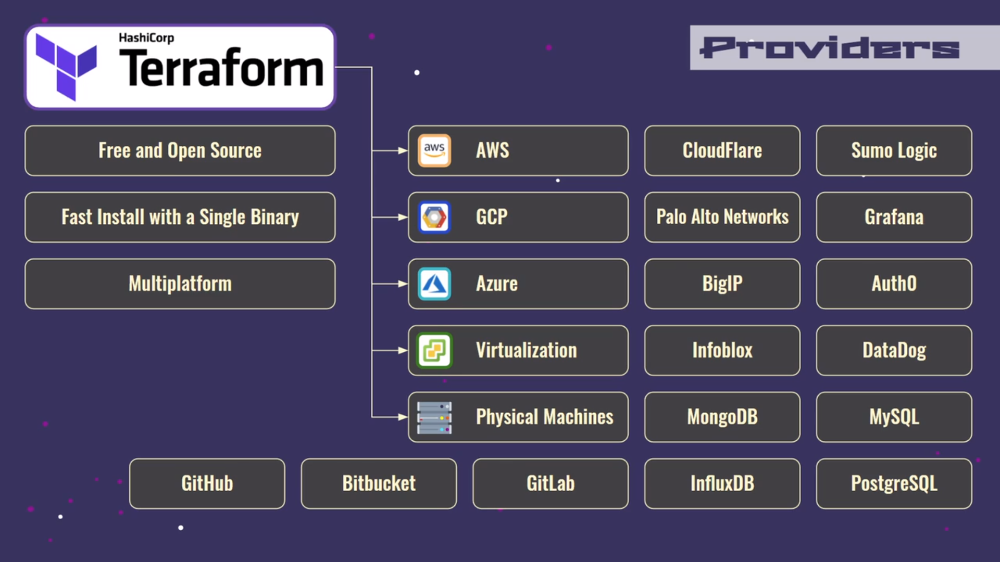
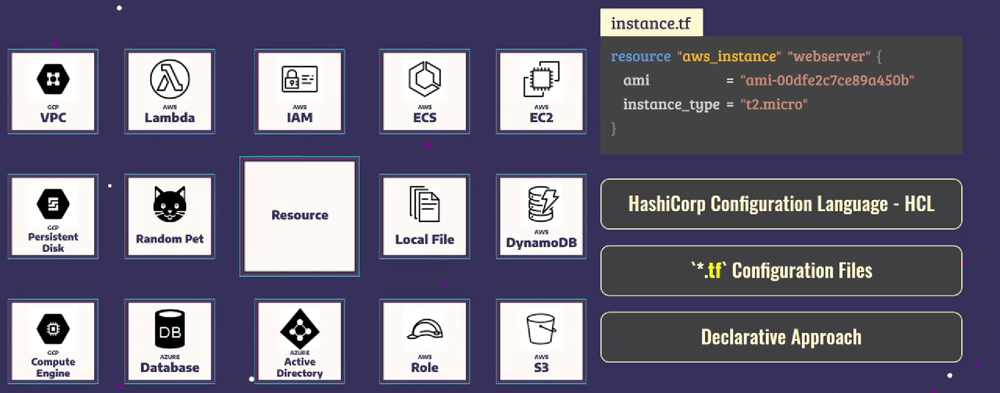
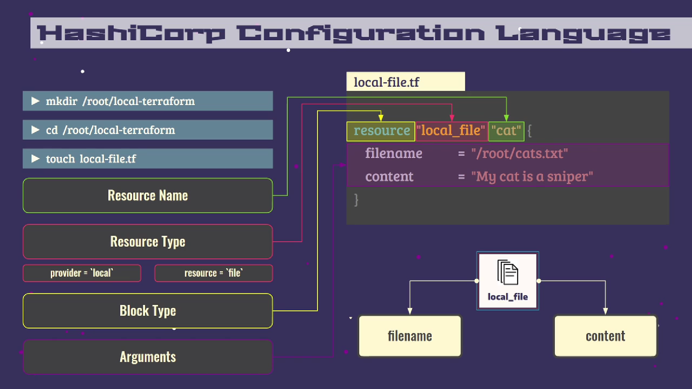

# Terraform

[Terraform](https://developer.hashicorp.com/terraform) — Infrastructure-as-Code инструмент, который позволяет безопасно и эффективно создавать, изменять и создавать версии инфраструктуры.

Terraform позволяет быстро создать инфраструктуру в облачных сервисах и управлять ею с помощью файлов конфигураций. В файлах конфигураций хранится описание инфраструктуры на языке HCL (HashiCorp Configuration Language).

<iframe width="100%" height="444" src="https://www.youtube.com/embed/videoseries?list=PLg5SS_4L6LYujWDTYb-Zbofdl44Jxb2l8" title="YouTube video player" frameborder="0" allow="accelerometer; autoplay; clipboard-write; encrypted-media; gyroscope; picture-in-picture; web-share" allowfullscreen></iframe>

https://cloud.yandex.ru/docs/tutorials/infrastructure-management/terraform-quickstart

https://rotoro.cloud/ld-courses/terraform-%D0%B4%D0%BB%D1%8F-%D0%BD%D0%B0%D1%87%D0%B8%D0%BD%D0%B0%D1%8E%D1%89%D0%B8%D1%85-%D0%BF%D1%80%D0%B0%D0%BA%D1%82%D0%B8%D1%87%D0%B5%D1%81%D0%BA%D0%B8%D0%B9-%D0%BE%D0%BF%D1%8B%D1%82/

https://habr.com/ru/companies/otus/articles/696694/

## Провайдеры

Terraform – мультиплатформенный инструмент. Это достигается через провайдеры. Провайдеры позволяют Terraform взаимодействовать с публичными облачными платформами, сетевой инфраструктурой, системами мониторинга, БД, системами контроля версий.



## Hashicorp Configuration Language

HCL — декларативный язык для определения ресурсов инфраструктуры, которые должны быть предоставлены в виде блоков кода.

"Декларативный" означает, что код описывает желаемое нами состояние инфраструктуры.

## Принцип работы

Terraform работает в 3 этапа:

1. **Init**. Инициализация проекта и определение провайдеров, которые будут использоваться для целевой среды.
2. **Plan**. Составление плана перехода в целевое состояние.
3. **Apply**. Приведение среды в целевое состояние.

## Ресурсы

Ресурс — каждый объект, которым управляет Terraform. Может быть вычислительным экземпляром, сервером в облаке или физическим локальным сервером.



Terraform управляет ЖЦ ресурсов от создания и конфигурации до вывода из эксплуатации.

Terraform записывает состояние инфраструктуры `terraform.tfstate`. На основе этой информации он определяет, какие действия необходимо совершить для приведения среды в целевое состояние.

Terraform может гарантировать, что вся инфраструктура находится в определенном состоянии `terraform.tfstate`.

Пример файла конфигурации для создания локального файла:



## Создание ресурса

1. Создайте файл конфигурации, например, для создания локального файла:

   ```tf
   resource "local_file" "resource_name" {
     filename     = "/root/file.txt"
     content      = "Hello World!"
   }
   ```

2. Выполните команду `terraform init`. Команда проверяет файл конфигурации и инициализирует рабочую папку с TF-файлом.
3. Выполните команду `terraform plan`. Команда покажет действия, которые будут выполнены для создания ресурса.
4. Выполните команду `terraform apply`. Команда снова покажет планируемые действия.
5. Укажите `Yes` для подтвержения действий. Начнется создание ресурса.
6. При необходимости выполните команду `terraform show`. Команда покажет подробную информацию о ресурсе.

## Удаление инфраструктуры

1. Выполните команду `terraform destroy`. Команда покажет действия, которые будут выполнены для удаления инфраструктуры.
2. Укажите `Yes` для подтвержения действий.