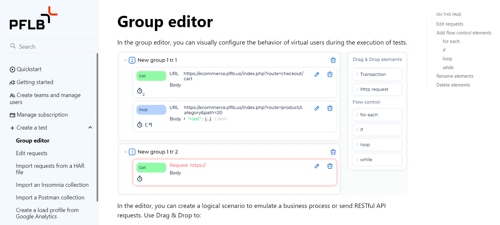
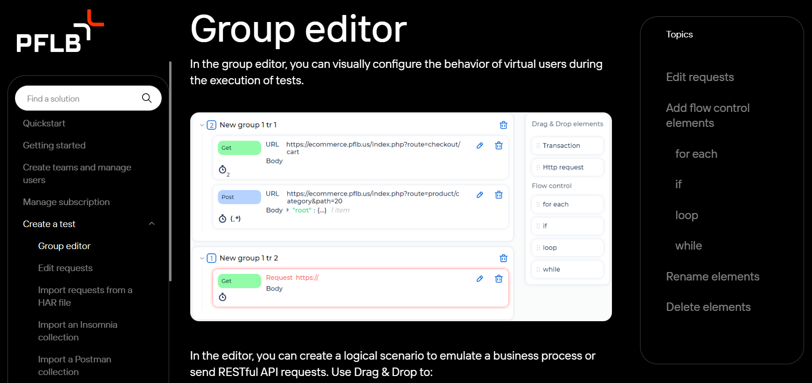

# CSS

Я изучал CSS в рамках редизайна [документации PFLB Platform](https://pflb.us/docs/en/index).

## Было

Дизайн используется в Enterprise версии: https://enterprise.boomq.io/docs/en/

## Стало

Дизайн используется в Cloud версии: https://pflb.us/docs/en/