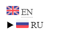

# Создание шаблона

## Задача

Добавить в документацию переключатель языков:

- российский флаг содержит ссылку на русскую версию документации;
- британский флаг содержит ссылку на английскую версию документации;



## Решение

Решение применимо для темы Alabaster:

1. В `conf.py` добавьте switcher.html в параметр html_sidebars:

   ```py title="conf.py"
   html_sidebars = {
    "**": [
        "sidebar/brand.html",
        "sidebar/search.html",
        "sidebar/scroll-start.html",
        "sidebar/navigation.html",
        "sidebar/scroll-end.html",
        "sidebar/switcher.html",
    	]
	}
	```
2. Добавьте изображения флагов.
3. Добавьте в проект файл:

   ```html title="/_templates/sidebar/switcher.html"
   <div class = "sidebar-search">
       <div class = "lflag" style = "display:inline;margin-inline-end: 10px;">
       
          
              <a style="font-size:16px;" href = "../{{lcode}}/{{pagename}}.html">{{lname}}</a>
       
           
           <span style="font-size:16px;font-weight:bold">{{lname}}</span>
       
       </div>
       
   </div>
   ```